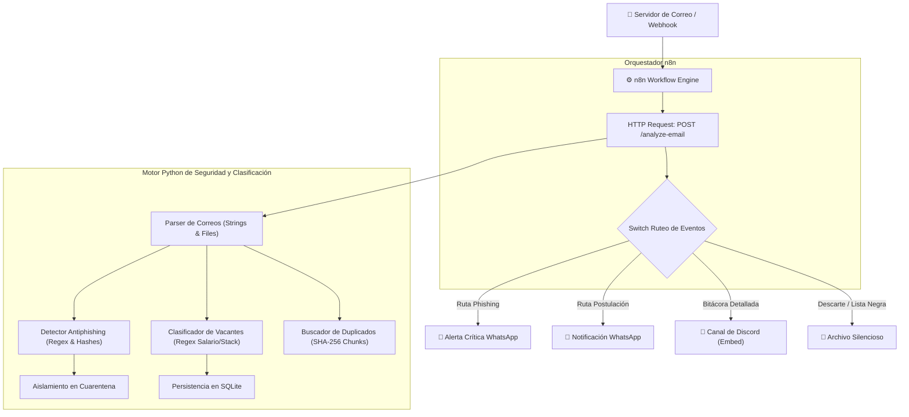

# 🛡️ Job Security & Application Tracking Agent
### *Agente Inteligente de Postulaciones Laborales, Detección de Phishing y Deduplicación Criptográfica*

[](https://python.org)
[](https://fastapi.tiangolo.com)
[](https://n8n.io)
[-success.svg)]()
[](LICENSE)

---

## 📌 Descripción General

**Job Security & Application Tracking Agent** es una solución técnica integral y personal diseñada para automatizar la monitorización y seguimiento de procesos de selección laboral sin interactuar ni responder automáticamente a los reclutadores, garantizando discreción absoluta.

El agente combina la potencia de **n8n** como orquestador de eventos y flujos de mensajería con un núcleo en **Python** especializado en:
1. **Detección Heurística de Phishing y Ciberamenazas**: Análisis forense de cabeceras, enlaces con spoofing visual y patrones de intimidación o estafas laborales.
2. **Clasificación Inteligente de Vacantes**: Identificación de bolsas de trabajo (LinkedIn, Indeed, Computrabajo) y ATS corporativos (Workday, Greenhouse, Lever), extrayendo automáticamente **salario**, **modalidad** y **stack tecnológico**.
3. **Buscador Criptográfico de Archivos Duplicados**: Escáner de almacenamiento en bloques de 64 KB con hashing MD5 y SHA-256 para depurar versiones redundantes de CVs y adjuntos de correo.
4. **Interacción Bidireccional en WhatsApp**: Control total del asistente vía comandos interactivos (`!resumen`, `!estado`, `!pendientes`, `!analizar`, `!duplicados`, `!limpiar`, etc.).
5. **Bitácora Técnica en Discord**: Registro en segundo plano con embeds detallados para no saturar tu mensajería personal.

---

## 🏗️ Arquitectura del Sistema



---

## 💻 Pilares Técnicos Implementados

| Pilar | Implementación Concreta en el Código |
| :--- | :--- |
| **n8n** | Workflows exportados en JSON para ingesta de buzón, ruteo por switch y bot interactivo bidireccional. |
| **Python** | Microservicio REST con FastAPI, runners CLI y suite de pruebas unitarias/integración con `pytest`. |
| **Strings** | Normalización Unicode, sanitización de etiquetas HTML, detección de hipervínculos engañosos y tokens de empresa. |
| **Expresiones Regulares (Regex)** | Límites de palabra (`\b`), grupos no-capturadores (`(?:...)`), patrones de intimidación psicológica y extracción de salarios/stack. |
| **Hashing** | Lectura por streaming de buffers constantes (64 KB) con MD5 y SHA-256 para auditoría de archivos y URLs. |
| **Archivos (Files)** | Manejo de estructuras `.eml`, aislamiento seguro en `data/quarantine/`, backup de adjuntos y persistencia SQLite. |

---

## 📱 Comandos Interactivos de WhatsApp

El bot soporta interacción bidireccional completa. Puedes enviarle cualquiera de estos comandos desde tu chat personal:

| Comando | Utilidad | Ejemplo de Salida |
| :--- | :--- | :--- |
| **`!resumen`** | Muestra el estado consolidado de todas tus postulaciones y amenazas bloqueadas. | *Total: 6 \| Entrevistas: 4 \| Pruebas Técnicas: 1 \| Bloqueadas: 5* |
| **`!estado <empresa>`** | Consulta el último movimiento y tareas pendientes con una empresa en específico. | `!estado Mercado Libre` ➔ *Invitación a entrevista técnica ($4,500 USD, Remoto)* |
| **`!pendientes`** | Lista únicamente los procesos donde debes realizar una acción (agendar llamada, entregar código). | *1. Nubank (Prueba Técnica) \| 2. Mercado Libre (Entrevista)* |
| **`!rechazos`** | Muestra los procesos finalizados para no darles seguimiento innecesario. | *Lista de candidaturas cerradas recientemente.* |
| **`!analizar <texto>`** | Escanea al instante cualquier mensaje o enlace sospechoso reenviado al chat. | `!analizar Gana $5000 al día dando likes...` ➔ *Score: 4.5/10 (SOSPECHOSO)* |
| **`!cuarentena`** | Inspecciona los correos fraudulentos que el bot frenó y envió a la bóveda de seguridad. | *Muestra remitentes maliciosos y nivel de riesgo.* |
| **`!duplicados`** | Ejecuta el escáner de hashes SHA-256 y reporta espacio ocupado por CVs y adjuntos repetidos. | *Archivos escaneados: 6 \| Duplicados: 2 \| Espacio: 45 MB* |
| **`!limpiar`** | Traslada automáticamente las copias redundantes a una carpeta de resguardo sin borrar originales. | *Limpieza completada: 3 archivos aislados.* |
| **`!ignorar <email/dominio>`** | Añade un remitente o dominio spammer a tu lista negra personal. | `!ignorar spam-jobs.com` ➔ *Remitente bloqueado.* |
| **`!silencio [horas]`** | Pausa temporalmente las alertas de WhatsApp durante reuniones o entrevistas. | `!silencio 2` ➔ *Modo silencio activo hasta las 19:30.* |
| **`!ayuda`** | Despliega la guía de comandos disponibles con formato amigable. | *Menú interactivo de ayuda.* |

---

## 🚀 Puesta en Marcha en 3 Pasos

### 1. Clonar y Configurar Entorno Virtual

```powershell
# Ubicarse en el directorio backend
cd backend

# Crear entorno virtual e instalar dependencias
python -m venv .venv
.\.venv\Scripts\pip install -r requirements.txt
```

### 2. Ejecutar Pruebas y Laboratorio Demo (1 Clic)

Puedes validar el funcionamiento completo de los 18 tests y ver una simulación real con el laboratorio interactivo:

```powershell
# Ejecutar suite de pruebas unitarias e integración
.\.venv\Scripts\pytest -v

# Ejecutar el laboratorio de demostración end-to-end
.\.venv\Scripts\python test_lab.py
```

### 3. Iniciar el Servidor y n8n

```powershell
# En una terminal: Iniciar API Python
.\.venv\Scripts\python run_service.py --serve

# En otra terminal: Iniciar n8n nativamente con Node.js
npx n8n
```

1. Abre tu navegador en **`http://localhost:5678`**.
2. Dirígete a **Workflows** ➔ **Import from File**.
3. Selecciona `workflows/email_analyzer_workflow.json` y `workflows/whatsapp_bidirectional_bot_workflow.json`.

---

## 📂 Estructura del Repositorio

```text
n8n/
├── backend/
│   ├── src/
│   │   ├── api.py                      # Endpoints FastAPI para n8n
│   │   ├── command_handler.py          # Lógica de comandos interactivos de WhatsApp
│   │   ├── config.py                   # Configuración y variables de entorno
│   │   ├── database.py                 # Persistencia SQLite local
│   │   ├── duplicate_finder.py         # Hashing SHA-256/MD5 en bloques para duplicados
│   │   ├── email_parser.py             # Parser de cadenas, archivos .eml y HTML
│   │   ├── job_classifier.py           # Clasificador de vacantes con Regex (salario/stack)
│   │   ├── notifier.py                 # Despachador de WhatsApp (Twilio/Mock) y Discord
│   │   └── phishing_detector.py        # Motor heurístico antiphishing y cuarentena
│   ├── tests/
│   │   ├── test_api_endpoints.py       # Pruebas de integración de la API
│   │   ├── test_command_handler.py     # Pruebas de comandos de WhatsApp
│   │   ├── test_duplicate_finder.py    # Pruebas de deduplicación criptográfica
│   │   ├── test_job_classifier.py      # Pruebas de regex de empleo
│   │   └── test_phishing.py            # Pruebas del motor antiphishing
│   ├── data/
│   │   ├── samples/                    # Muestras reales (.json y .eml)
│   │   ├── attachments/                # Archivos de prueba para escaneo
│   │   └── quarantine/                 # Bóveda de correos maliciosos aislados
│   ├── test_lab.py                     # Demostración E2E con 1 comando
│   ├── run_service.py                  # CLI runner del microservicio
│   └── requirements.txt                # Dependencias fijadas
├── workflows/
│   ├── email_analyzer_workflow.json    # Workflow n8n principal de análisis y ruteo
│   └── whatsapp_bidirectional_bot_workflow.json # Workflow n8n del bot de WhatsApp
├── docs/
│   ├── ARCHITECTURE.md                 # Especificación técnica de arquitectura
│   ├── REGEX_AND_HASHING.md            # Guía detallada de expresiones regulares y hashes
│   └── N8N_SETUP_GUIDE.md              # Manual de configuración local de n8n
├── .env.example                        # Plantilla de variables de entorno
├── LICENSE                             # Licencia Apache 2.0
└── README.md                           # Documentación principal
```

---

## 📜 Licencia

Distribuido bajo la licencia **Apache 2.0**. Consulta el archivo [`LICENSE`](LICENSE) para más detalles.
