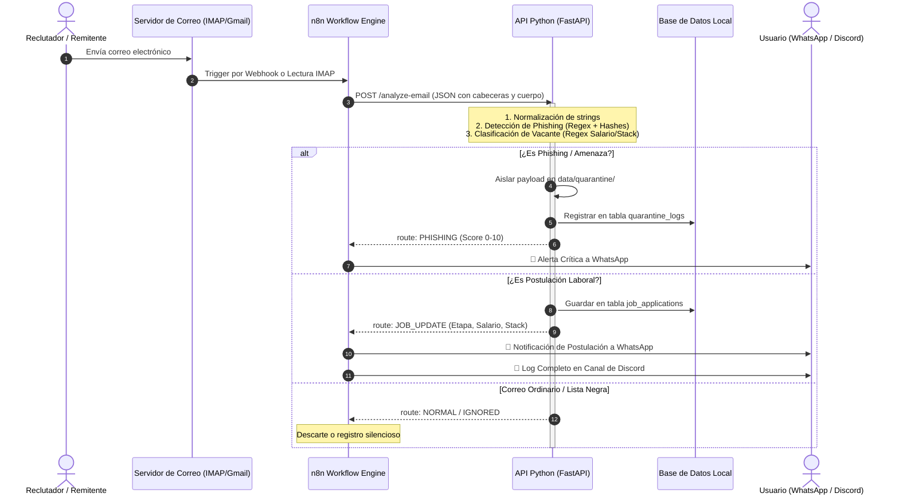

# Especificación Técnica de Arquitectura: Email Security & Job Tracker Agent

## 1. Visión y Objetivos

Este sistema automatiza la gestión personal de correos vinculados a procesos de selección y postulaciones laborales, integrando simultáneamente un motor forense de detección de ciberamenazas y phishing, y una herramienta de deduplicación de almacenamiento.

### Principios de Diseño
- **No Invasivo**: El agente **no responde** automáticamente a los correos para evitar enviar respuestas erróneas o no profesionales a reclutadores.
- **Canal de Alta Prioridad (WhatsApp)**: Notificaciones concisas y enriquecidas con emojis que señalan acciones pendientes (agendar entrevista, entregar prueba técnica).
- **Bitácora de Auditoría (Discord)**: Canal de respaldo con embeds detallados que contienen datos técnicos de seguridad, cabeceras, salario y stack tecnológico.
- **Defensa en Profundidad**: Análisis heurístico multi-capa (expresiones regulares, desarmado de URLs, cálculo de hashes SHA-256/MD5 y aislamiento en cuarentena).

---

## 2. Diagrama de Flujo del Sistema

---

## 3. Componentes del Backend

### 3.1. `EmailParser` (`email_parser.py`)
- Sanitización de HTML a texto plano sin pérdida de hipervínculos.
- Extracción de cabeceras SPF y DKIM.
- Detección de spoofing de enlaces (cuando el texto ancla `<a>` aparenta un dominio oficial pero el atributo `href` apunta a una IP o URL fraudulenta).

### 3.2. `PhishingDetector` (`phishing_detector.py`)
- **Heurística de Urgencia**: Detecta patrones de intimidación y coerción psicológica.
- **Recolección de Credenciales**: Bloquea solicitudes de contraseñas, PIN y tokens.
- **Estafas Laborales**: Identifica ofertas falsas de Telegram/Cripto con pagos por adelantado.
- **Typosquatting**: Detección de homoglifos y falsos subdominios.
- **Aislamiento en Cuarentena**: Los correos de alto riesgo se extraen de la memoria y se almacenan en `data/quarantine/` para análisis forense seguro.

### 3.3. `JobClassifier` (`job_classifier.py`)
- Detección de bolsas de empleo (`LinkedIn`, `Indeed`, `Computrabajo`, `OCC`, `Glassdoor`) y sistemas ATS (`Greenhouse`, `Lever`, `Workday`, `SmartRecruiters`, `BambooHR`).
- Clasificación de etapas del embudo: `POSTULACION_ENVIADA`, `ENTREVISTA`, `PRUEBA_TECNICA`, `OFERTA`, `RECHAZO`.
- Extracción de **Salario**, **Modalidad** y **Tech Stack** con regex de límites de palabra (`\b`).

### 3.4. `DuplicateFinder` (`duplicate_finder.py`)
- Optimización en 3 fases:
  1. Agrupación preliminar por tamaño de archivo (`file.stat().st_size`).
  2. Hashing MD5 rápido en bloques de 64 KB.
  3. Confirmación criptográfica SHA-256 para prevenir colisiones.
- Función de limpieza segura: traslada archivos redundantes a `data/reports/duplicates_backup/` preservando el archivo original.

### 3.5. `CommandHandler` (`command_handler.py`)
- Intérprete interactivo bidireccional para WhatsApp:
  - `!resumen`: Métricas consolidadas.
  - `!estado <empresa>`: Búsqueda rápida del último avance.
  - `!pendientes`: Tareas que requieren acción del usuario.
  - `!rechazos`: Procesos descartados.
  - `!analizar <texto/enlace>`: Escáner forense on-demand.
  - `!cuarentena`: Lista de amenazas neutralizadas.
  - `!duplicados`: Reporte de espacio recuperable.
  - `!limpiar`: Purga de adjuntos redundantes.
  - `!ignorar <empresa/email>`: Lista negra personal.
  - `!silencio [horas]`: Pausa temporal de notificaciones.
